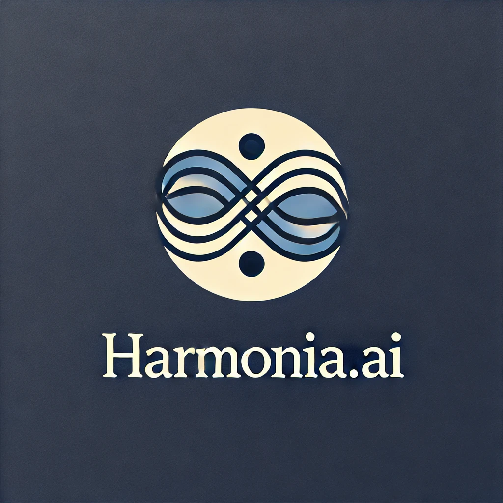
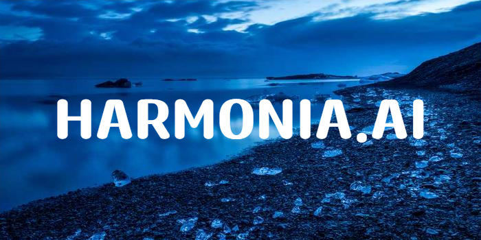

# HARMONIA.AI OFFICIAL PAGE





[](https://img.shields.io/github/v/release/navendu-pottekkat/awesome-readme?include_prereleases)
[](https://img.shields.io/github/issues-raw/navendu-pottekkat/awesome-readme)
[](https://img.shields.io/github/issues-pr/navendu-pottekkat/awesome-readme)
[](https://img.shields.io/github/license/navendu-pottekkat/awesome-readme)


Harmonia.ai


The badges used here were generated with [shields.io](https://shields.io/).


<!-- Add badges with link to Shields IO -->


: Current release version.


: The last commit time.


# Quick Start Demo


We will provide our AI as One-Click UI for easy to be use. You can use engine.py
> **Note**: Current Release.


# Installation


This is where your installation instructions go.

You can add snippets here that your readers can copy-paste with click:

```shell
gh repo clone Kutay32/Harmonia.ai
```


# License


[MIT license](./LICENSE)


